# Grapes 🍇

**Grapes** is a mobile & web app for running the day-to-day operations of a small bakery or pastry shop: ingredient stock across multiple storage locations, costed recipes with automatic margin calculation, a booking calendar for customer orders, supplier purchase orders, a daily production work plan, and ingredient cost trends over time.

Built with [Expo](https://expo.dev) + [Expo Router](https://docs.expo.dev/router/introduction/), it runs on iOS, Android and the web from a single codebase, backed by [Supabase](https://supabase.com) (Postgres + Auth).

<p align="center">
  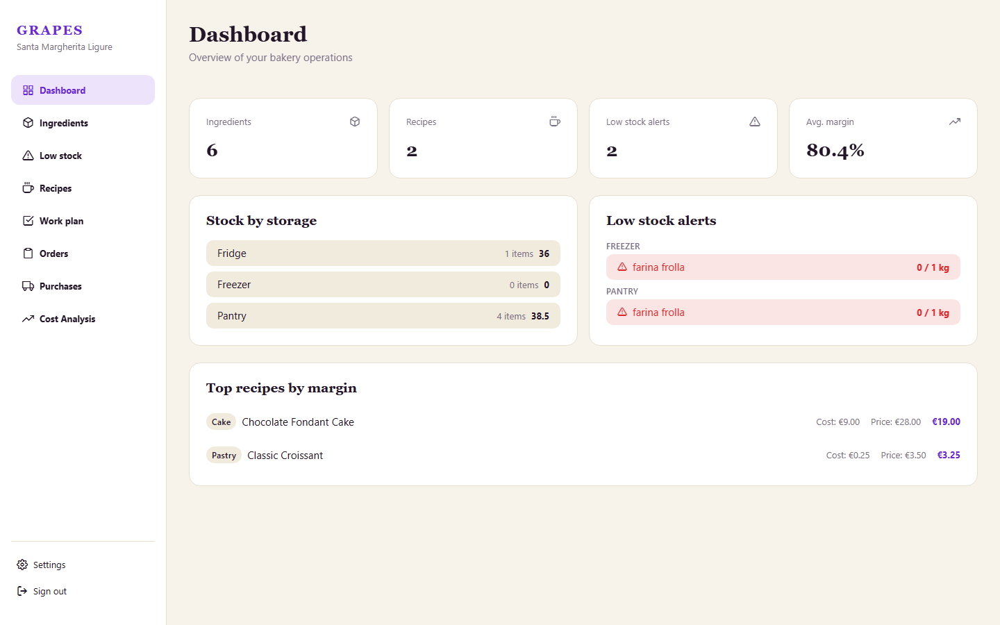
</p>

## Table of contents

- [Features](#features)
- [Tech stack](#tech-stack)
- [Data model](#data-model)
- [Getting started](#getting-started)
- [Project structure](#project-structure)

## Features

### 🔐 Authentication

Email/password sign-up and sign-in via Supabase Auth. Registering a bakery creates its account and an initial profile row (via a database trigger); a shared `AuthProvider` tracks the session and decides whether to show the auth screens or the app.

<p align="center">
  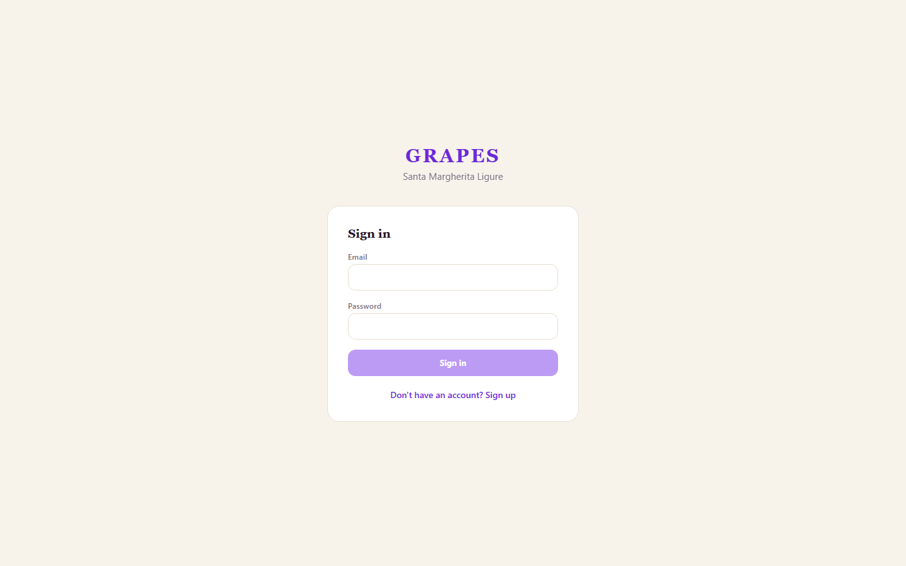
  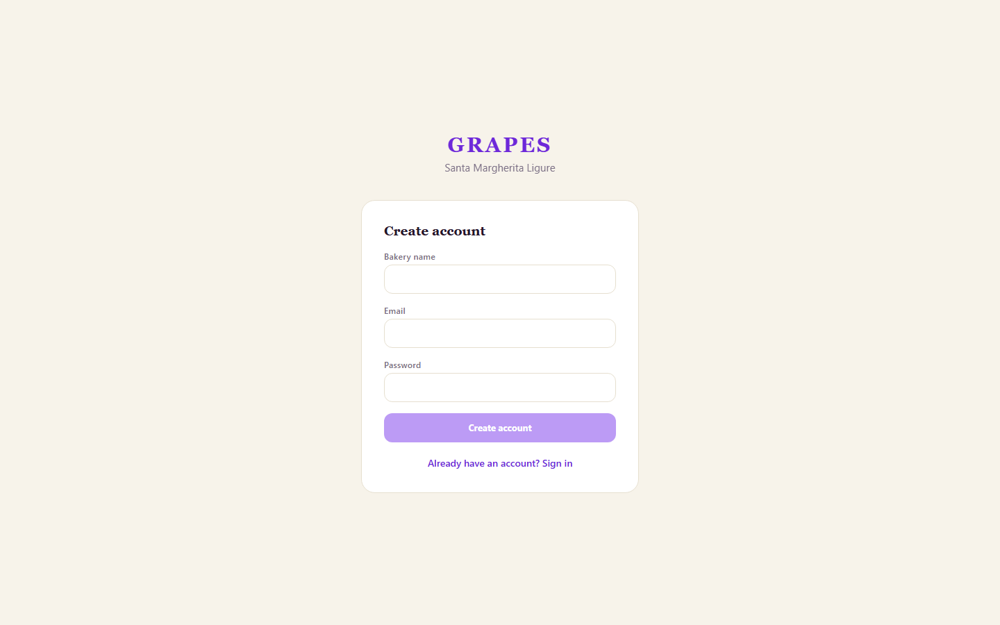
</p>

### 📊 Dashboard

An at-a-glance overview: ingredient/recipe counts, number of low-stock alerts, average recipe margin, stock quantity per storage location, the top 5 low-stock alerts, and the top 5 recipes ranked by margin.

### 📦 Ingredients & stock

Every raw ingredient is tracked across three storage locations (**fridge**, **freezer**, **pantry**), each with its own quantity and minimum-threshold alert. Ingredients can be searched, filtered by location, edited, deleted, or moved between locations in a single atomic operation (a Postgres RPC function handles the transfer so stock is never double-counted).

<p align="center">
  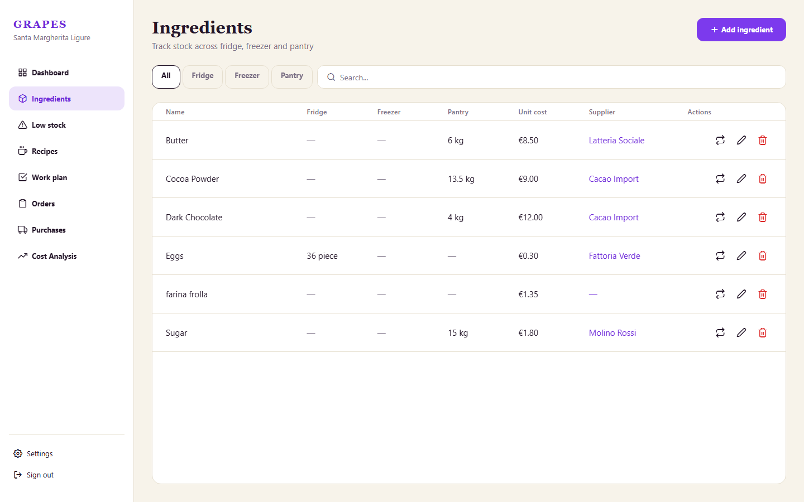
</p>

### ⚠️ Low stock

A dedicated, always-up-to-date view of every ingredient sitting under its minimum threshold, grouped by storage location — the same alerts surfaced (top 5 only) on the dashboard.

<p align="center">
  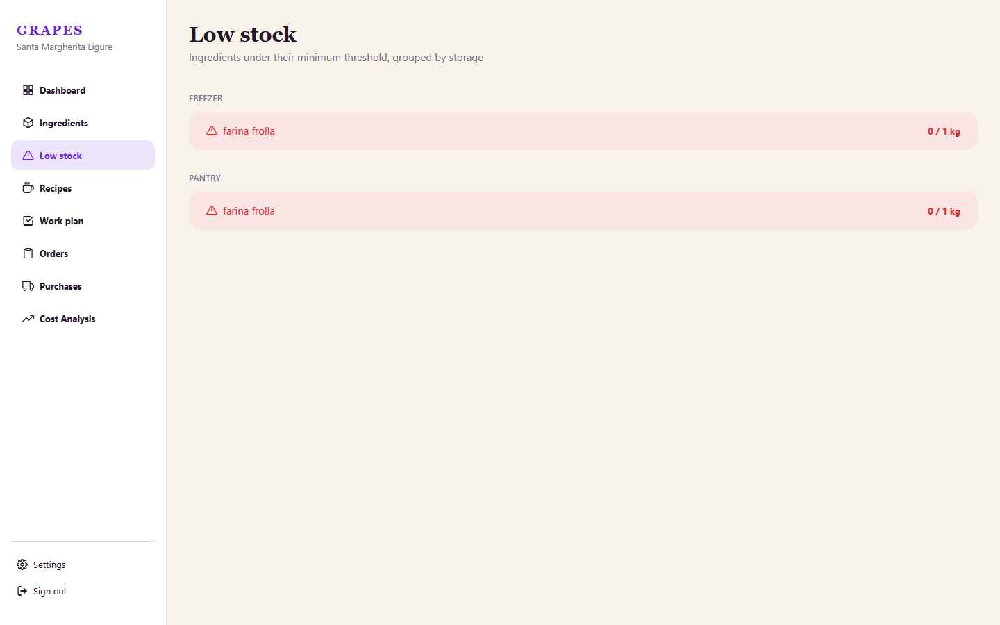
</p>

### 🧁 Recipes & components

Recipes can have multiple **variants** (e.g. a "Small"/"Large" size of the same cake), each with its own weight, portion count and ingredient list. A recipe line can point either to a raw ingredient *or* to a reusable **component** (a semi-finished batch like a dough or a cream, itself made of ingredients with its own cost-per-unit). Cost, sell price and margin are computed automatically from the ingredient/component costs — no manual bookkeeping.

<p align="center">
  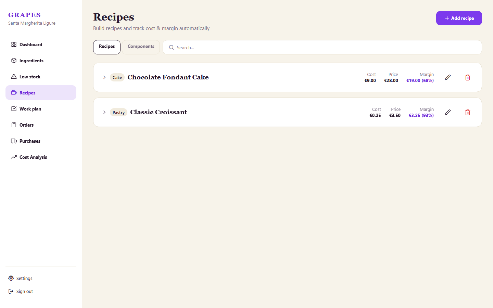
</p>

### 📅 Orders

A full calendar (month/week/day views) for managing customer orders: who ordered what, for pickup on which date, and its status (pending → confirmed → ready → delivered, or cancelled). Orders can be linked to a recipe/variant from the catalog or be entirely custom ("off-catalog" cakes).

<p align="center">
  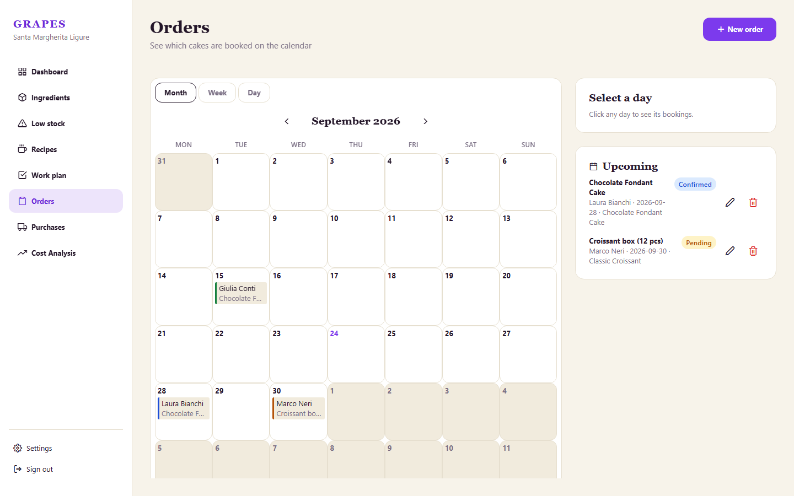
</p>

### 🚚 Purchases

Supplier purchase orders with line items (ingredient, quantity, destination storage, unit cost). Marking an order as **arrived** atomically updates its status and credits the ordered quantities to stock — again via a single Postgres transaction, so stock levels always stay consistent.

<p align="center">
  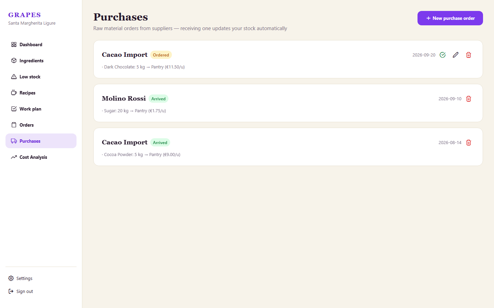
</p>

### ✅ Work plan

A day-by-day production checklist. A task can be a simple to-do, or linked to producing a **component** or a **recipe variant** in a given quantity: completing it atomically deducts the ingredients it consumes (from a chosen source location) and adds the finished goods to the target location's stock.

<p align="center">
  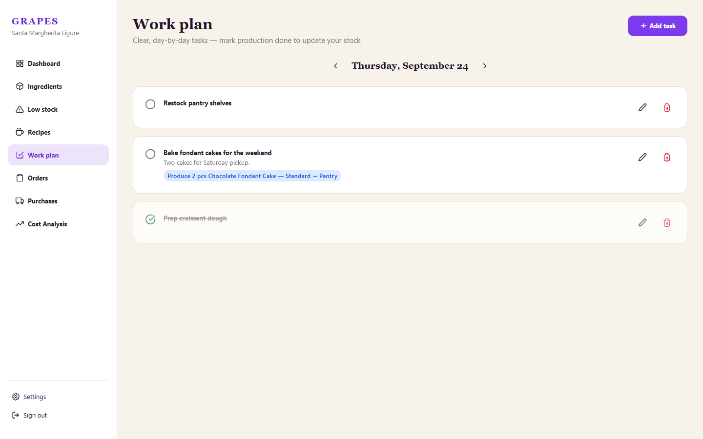
</p>

### 📈 Cost analysis

Every time an ingredient's cost changes, it's logged automatically to a cost-history table. This screen turns that history into a monthly trend line and a year-over-year comparison, per ingredient or averaged across all of them — useful for spotting price drift from suppliers early.

<p align="center">
  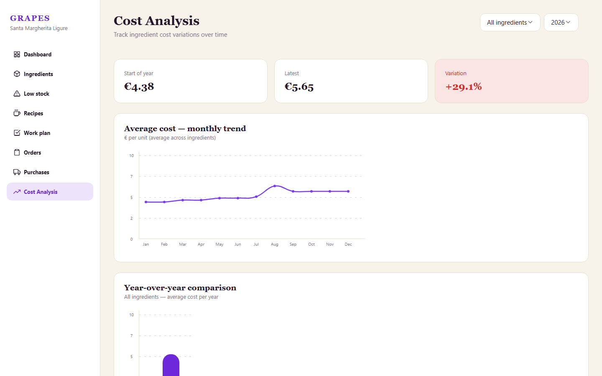
</p>

### ⚙️ Settings

App language (English/Italian, synced to the user's profile so it follows them across devices) and theme (system/light/dark).

<p align="center">
  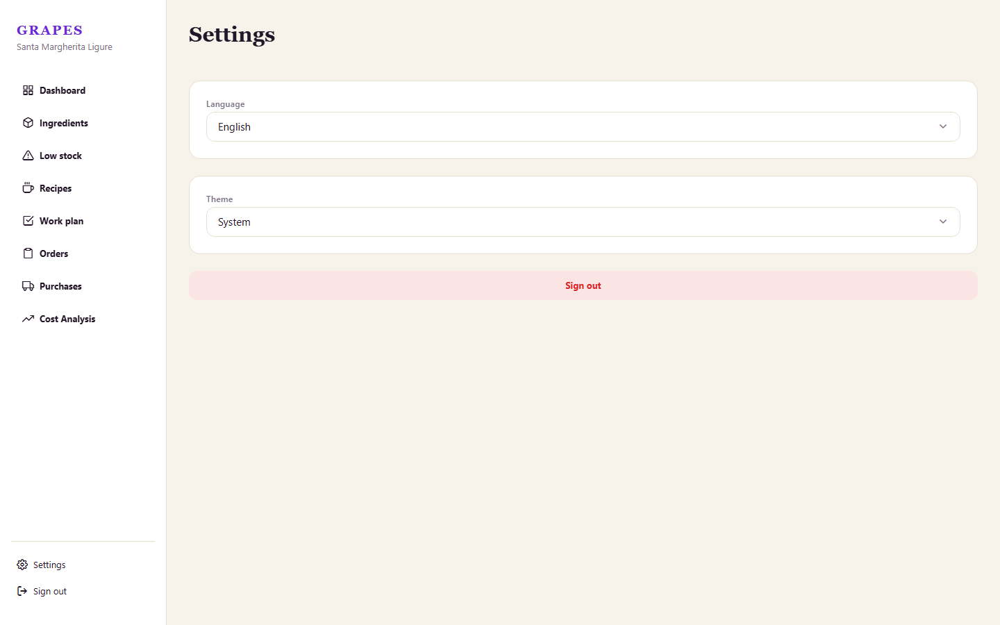
</p>

### 📱 Responsive by design

The same codebase adapts from a desktop sidebar layout down to a phone-sized bottom tab bar, with no separate mobile app to maintain.

<p align="center">
  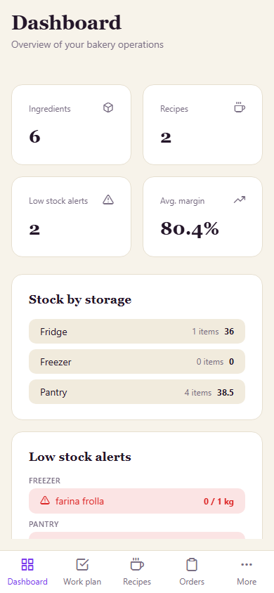
  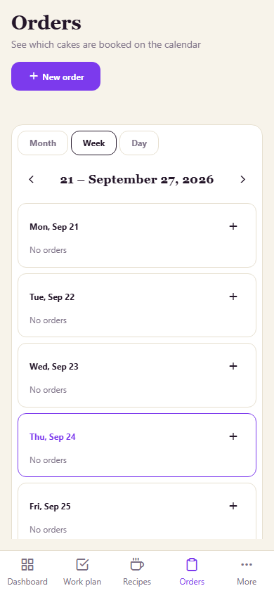
</p>

## Tech stack

| Layer | Choice |
|---|---|
| Framework | [Expo](https://expo.dev) ~57 + [Expo Router](https://docs.expo.dev/router/introduction/) (file-based routing, `(auth)`/`(app)` groups) |
| UI | React Native / React Native Web, a small custom design-system (`src/components/ui`) |
| Backend | [Supabase](https://supabase.com) — Postgres, Auth, Row Level Security, and RPC functions for atomic stock operations |
| Data fetching | [TanStack Query](https://tanstack.com/query) |
| Charts | [react-native-gifted-charts](https://github.com/Abhinandan-Kushwaha/react-native-gifted-charts) |
| Validation | [Zod](https://zod.dev) |
| Localization | Custom `I18nProvider` (English/Italian), auto-detected via `expo-localization` |
| Language | TypeScript |

The app targets **iOS, Android and Web** from the same codebase.

## Data model

All data is stored in Postgres behind Supabase Row Level Security, so every table is scoped to its `owner_id` (the signed-in bakery). See [`supabase/schema.sql`](supabase/schema.sql) for the full definition. The core entities:

- **Ingredients** — raw materials, with per-location stock (`ingredient_stock`) and an automatically-logged cost history (`cost_history`).
- **Components** — reusable semi-finished preparations made from ingredients, with a computed cost per unit.
- **Recipes → Variants → Variant ingredients** — a recipe has one or more variants, each with its own ingredient/component list and computed cost, margin and sell price.
- **Orders** — customer bookings, optionally linked to a recipe variant, placed on a pickup calendar.
- **Purchase orders → Items** — supplier orders that restock ingredients on arrival.
- **Work plan tasks** — daily to-dos, optionally linked to producing a component or recipe variant.

Three atomic operations are implemented as Postgres functions (rather than multi-step client code) to guarantee stock consistency: `move_stock`, `receive_purchase_order`, and `complete_work_plan_task`.

## Getting started

### Prerequisites

- Node.js and npm
- A [Supabase](https://supabase.com) project (EU region recommended for GDPR)
- Expo Go, an iOS/Android simulator, or just a web browser

### 1. Install dependencies

```bash
npm install
```

### 2. Set up Supabase

1. Create a new Supabase project.
2. Run [`supabase/schema.sql`](supabase/schema.sql) in the Supabase SQL editor, followed by the migration files in [`supabase/`](supabase/) in date order.
3. Copy `.env.example` to `.env` and fill in your project's values:

   ```bash
   EXPO_PUBLIC_SUPABASE_URL=https://<your-project-ref>.supabase.co
   EXPO_PUBLIC_SUPABASE_ANON_KEY=<your-anon-key>
   ```

### 3. Run the app

```bash
npx expo start       # then choose iOS, Android, or web from the CLI
npm run web          # or go straight to the web build
```

## Project structure

```
src/
  app/                    # Expo Router routes
    (auth)/               # login, register
    (app)/                 # dashboard, ingredients, recipes, orders, purchases, work-plan, cost-analysis, settings, ...
  features/               # one folder per domain: api.ts (Supabase queries), hooks.ts (React Query), edit modals
  components/
    layout/                # AppShell, Sidebar, BottomTabBar, PageHeader — the responsive shell
    ui/                    # Button, Card, Modal, Select, TextField, ... the shared design system
  i18n/                   # English/Italian translations
  lib/                    # Supabase client, query client, shared helpers
  types/database.ts       # TypeScript types mirroring the Postgres schema
supabase/
  schema.sql              # full database schema, RLS policies and RPC functions
  migration-*.sql         # incremental migrations, in date order
```
