# GRAPES — Guida all'app

### Come funziona Grapes e a cosa serve ogni sua sezione, per la gestione quotidiana della pasticceria

*Santa Margherita Ligure*

---

## Indice

1. [Cos'è Grapes](#cosè-grapes)
2. [Dashboard](#1-dashboard)
3. [Ingredienti](#2-ingredienti)
4. [In esaurimento](#3-in-esaurimento)
5. [Ricette & Componenti](#4-ricette--componenti)
6. [Ordini](#5-ordini)
7. [Acquisti](#6-acquisti)
8. [Piano di lavoro](#7-piano-di-lavoro)
9. [Analisi costi](#8-analisi-costi)
10. [Impostazioni](#9-impostazioni)
11. [Come si tiene insieme tutto](#come-si-tiene-insieme-tutto)
12. [Un'app, tutti i tuoi dispositivi](#unapp-tutti-i-tuoi-dispositivi)
13. [Domande frequenti](#domande-frequenti)
14. [Le sezioni in breve](#le-sezioni-in-breve-tabella-riassuntiva)

---

## Cos'è Grapes

Grapes è l'app che tiene insieme tutto il lato "gestionale" della pasticceria: cosa hai in dispensa, quanto ti costano le ricette, cosa devi consegnare e quando, cosa devi ordinare ai fornitori, cosa fare oggi in laboratorio.

Invece di tenere traccia di tutto questo a mente, su un quaderno o su fogli Excel separati, Grapes collega tutto: quando ricevi una consegna le scorte si aggiornano da sole, quando prepari una torta gli ingredienti si scalano in automatico, e il costo di ogni ricetta è sempre calcolato sui prezzi reali — mai una stima.

**Funziona su telefono, tablet e computer**, con gli stessi dati sempre aggiornati ovunque tu acceda: se aggiungi un ingrediente dal telefono in laboratorio, lo vedi subito anche aprendo l'app dal computer in ufficio. Non serve installare nulla di diverso per ogni dispositivo: è la stessa app, che si adatta allo schermo che stai usando.

In sintesi, Grapes ti aiuta a rispondere sempre a quattro domande, in qualsiasi momento della giornata:

- **Cosa ho in magazzino, e cosa sta per finire?**
- **Quanto mi costa davvero ogni ricetta, e quanto ci guadagno?**
- **Cosa devo consegnare, e quando?**
- **Cosa devo fare oggi in laboratorio?**

Le pagine che seguono spiegano ogni sezione dell'app nel dettaglio, con gli screenshot reali presi dall'app in versione web.

---

## 1. Dashboard

La prima schermata che vedi dopo aver fatto accesso: un colpo d'occhio su tutta l'attività della pasticceria, senza dover entrare in nessuna sezione specifica.

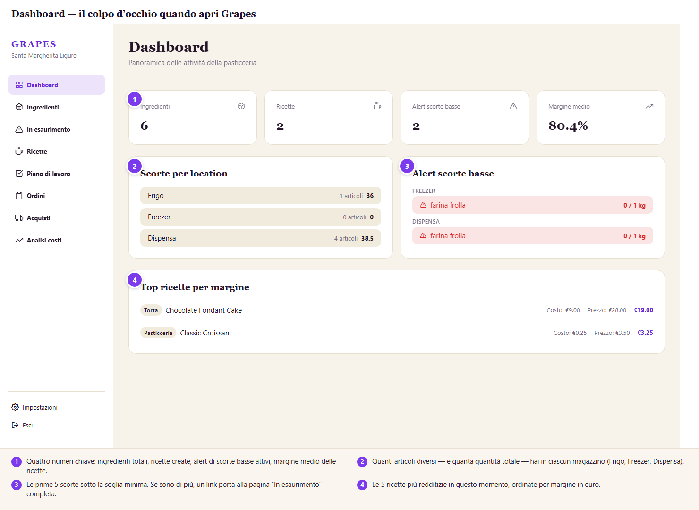

Quattro blocchi, dall'alto in basso:

1. **Quattro numeri chiave** — quanti ingredienti e ricette hai in catalogo, quanti alert di scorte basse sono attivi in questo momento, e il margine medio di tutte le tue ricette con un prezzo di vendita impostato.
2. **Scorte per magazzino** — per ciascuno dei tre magazzini (Frigo, Freezer, Dispensa), quanti articoli diversi contiene e la quantità totale.
3. **Alert scorte basse** — le prime 5 scorte scese sotto la soglia minima che hai impostato. Se sono di più, un link ti porta alla pagina "In esaurimento" completa.
4. **Top ricette per margine** — le 5 ricette più redditizie in questo momento, con costo, prezzo di vendita e margine in euro.

> **Da notare:** la Dashboard è di sola lettura — è pensata per guardare, non per modificare. Per cambiare qualcosa vai nella sezione specifica (Ingredienti, Ricette, ecc.).

---

## 2. Ingredienti

L'elenco di tutto ciò che tieni in Frigo, Freezer e Dispensa: quantità per ciascun magazzino, costo unitario, fornitore.

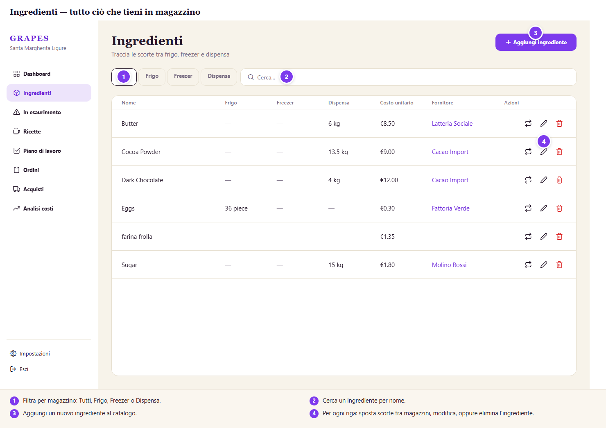

Cosa puoi fare da qui:

- **Filtrare** la lista per magazzino, o cercare un ingrediente per nome.
- **Aggiungere** un nuovo ingrediente dal pulsante in alto a destra: nome, unità di misura (kg, g, L, ml, pezzo, mazzo...), costo unitario, fornitore, e la quantità/soglia minima per ciascuno dei tre magazzini.
- **Modificare** quantità, costo o soglia minima in qualsiasi momento.
- **Spostare scorte** tra magazzini (es. scongelare qualcosa dal Freezer alla Dispensa) in un'unica operazione, senza dover prima sottrarre a mano da un lato e aggiungere dall'altro.
- **Eliminare** un ingrediente che non usi più.

### Modificare un ingrediente

Cliccando sull'icona della matita su una riga si apre il form di modifica, con una riga quantità/soglia minima per ciascuno dei tre magazzini:

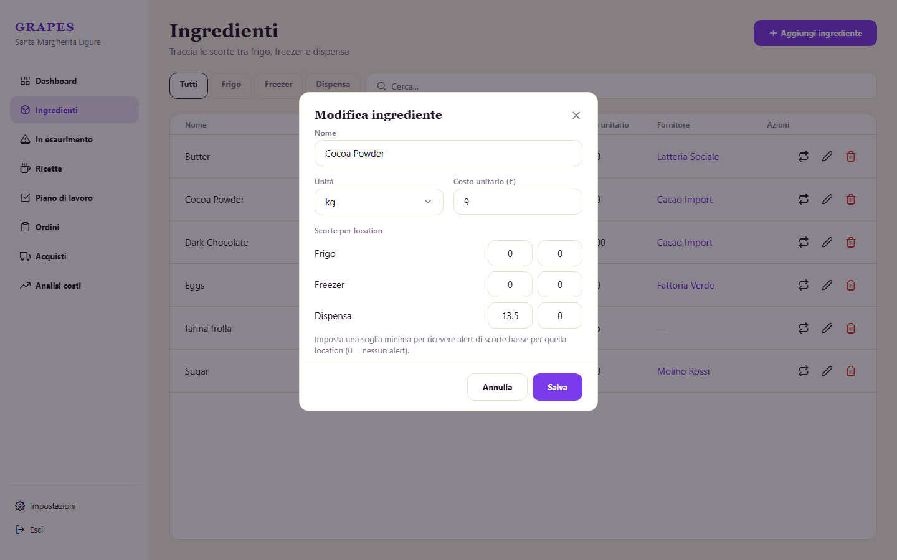

> **Perché impostare una soglia minima?** È il valore sotto il quale quell'ingrediente, in quel magazzino, compare come alert nella Dashboard e nella pagina "In esaurimento". Metti **0** se non vuoi ricevere nessun alert per quell'ingrediente/magazzino.

### Spostare scorte tra magazzini

Cliccando sull'icona con le due frecce si apre invece la modale per spostare una quantità da un magazzino a un altro:

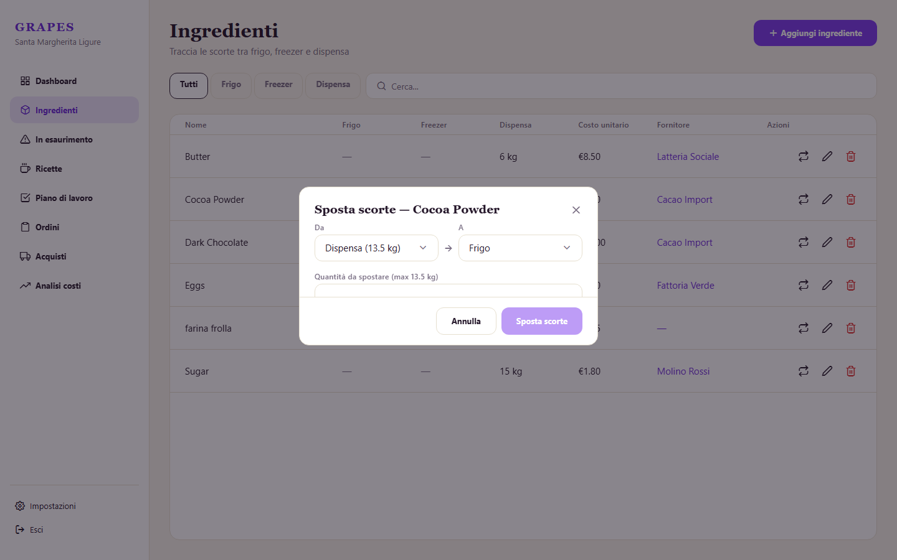

Il magazzino di origine mostra già quanto hai disponibile; non puoi spostare più di quella quantità.

---

## 3. In esaurimento

La versione "estesa" dell'alert che vedi in anteprima nella Dashboard: qui compaiono **tutti** gli ingredienti sotto soglia minima, non solo i primi 5, raggruppati per magazzino.

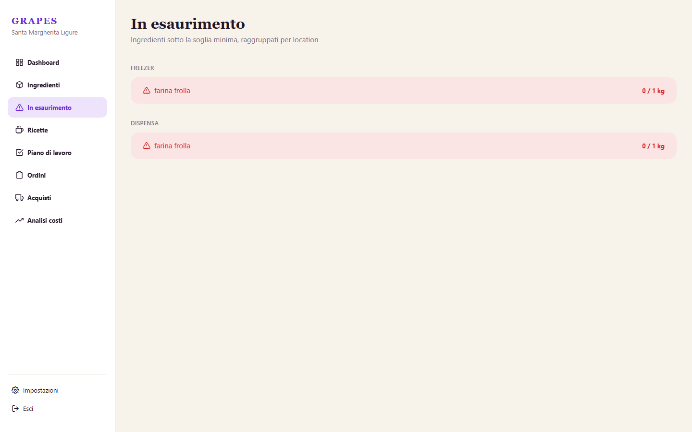

È una pagina di sola lettura: utile per fare un rapido controllo prima di aprire il laboratorio o prima di fare un ordine ai fornitori. Per modificare le quantità o la soglia minima, vai nella pagina **Ingredienti**.

---

## 4. Ricette & Componenti

Il cuore "economico" dell'app: qui costruisci le tue ricette e il costo si calcola da solo, ingrediente per ingrediente, senza bisogno di rifare i conti a mano ogni volta che cambia il prezzo di una materia prima.

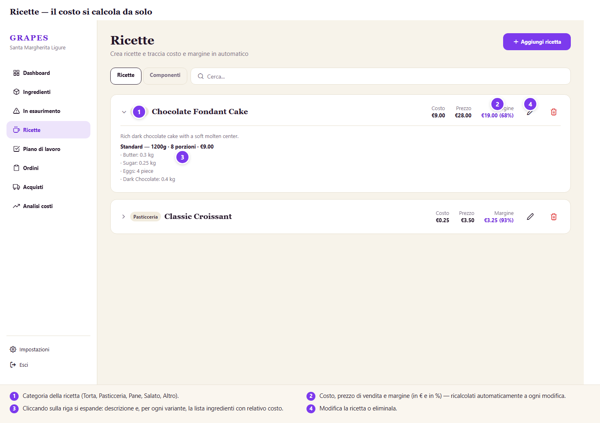

Alcuni concetti chiave:

- **Varianti** — una ricetta può avere più varianti (es. una torta in formato piccolo/grande, o con dosi diverse). Ognuna ha il proprio peso totale, numero di porzioni, lista ingredienti e costo calcolato indipendentemente.
- **Componenti** (la seconda scheda, accanto a "Ricette") — preparazioni riutilizzabili come una frolla, una crema o una glassa, ciascuna con il proprio costo per unità calcolato dai propri ingredienti. Una ricetta può usare un componente esattamente come userebbe un ingrediente: ad esempio, *Torta al limone = Frolla + Lemon curd + Glassa*, dove Frolla, Lemon curd e Glassa sono a loro volta componenti con i propri ingredienti e il proprio costo.
- **Costo, prezzo, margine** — sempre visibili e sempre aggiornati: se il costo di un ingrediente cambia (lo aggiorni nella pagina Ingredienti), il costo di tutte le ricette che lo usano si ricalcola automaticamente, la prossima volta che apri la pagina.

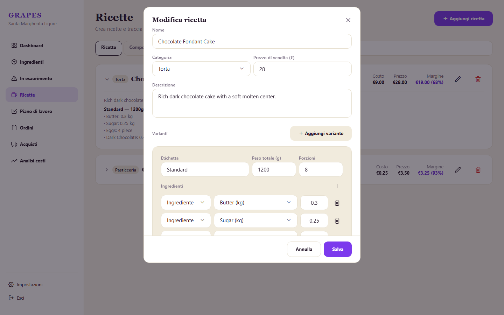

Nel form di modifica di una ricetta puoi aggiungere quante varianti vuoi, e per ciascuna variante scegliere riga per riga se un "ingrediente" è in realtà un ingrediente grezzo oppure un componente — con relativa quantità.

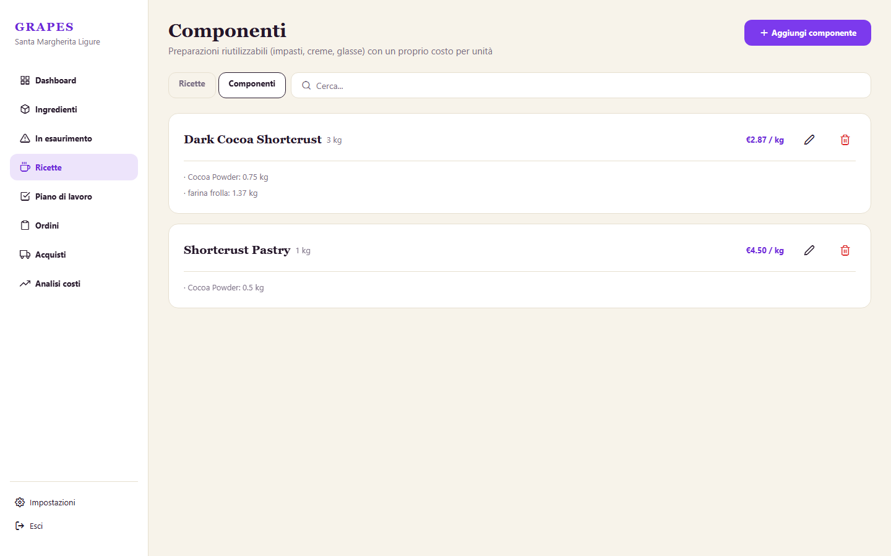

> **Suggerimento:** se usi la stessa preparazione (es. una frolla) in più ricette diverse, conviene crearla una volta sola come Componente, invece di ripetere la stessa lista di ingredienti in ogni ricetta — così se cambi la ricetta della frolla, si aggiorna automaticamente ovunque viene usata.

---

## 5. Ordini

Il calendario delle torte da consegnare: chi le ha ordinate, cosa, per quando, a che punto siamo e quanto costano.

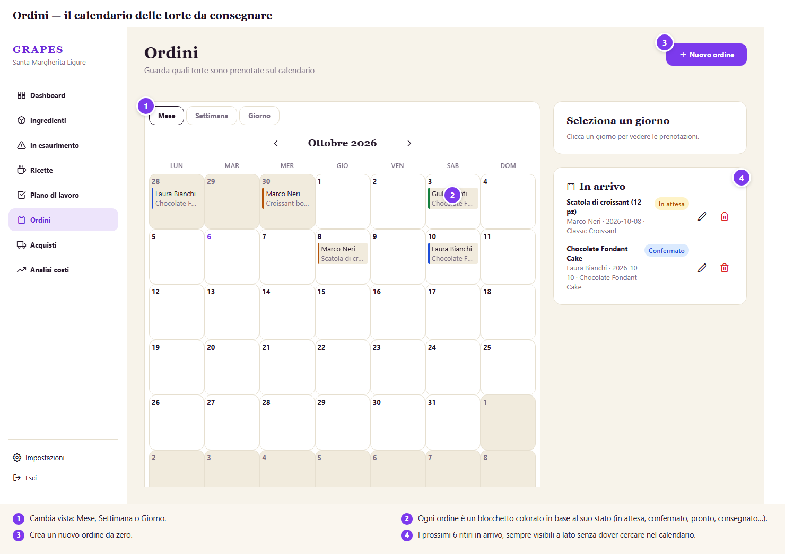

- **Tre viste** — Mese (colpo d'occhio sull'intero mese), Settimana e Giorno (per vedere più dettagli su un periodo più corto).
- **Colore = stato** — ogni ordine è un blocchetto colorato in base al suo stato: in attesa, confermato, pronto, consegnato o annullato.
- **Pannello laterale** — sempre visibile, mostra gli ordini del giorno selezionato e i prossimi 6 ritiri in arrivo, senza dover cercare nel calendario.
- **Il nome della torta è libero** — non serve aver già creato la ricetta per registrare un ordine: puoi scrivere qualsiasi nome. Se vuoi tenerne traccia con costo/margine, puoi comunque collegare una ricetta esistente (e, se ne ha più di una, anche la variante specifica).

Cliccando su un ordine esistente nel calendario si apre il form di modifica, con tutti i dettagli:

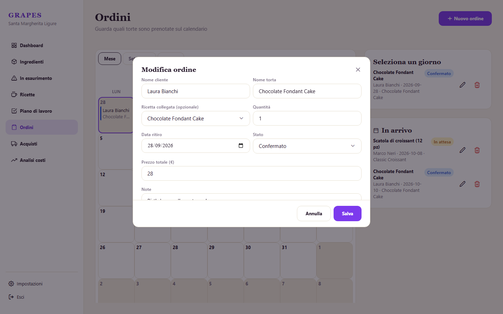

---

## 6. Acquisti

Quando ordini materie prime a un fornitore, lo registri qui: cosa, quanto, in quale magazzino andrà messo una volta arrivato, ed eventualmente il costo unitario pattuito.

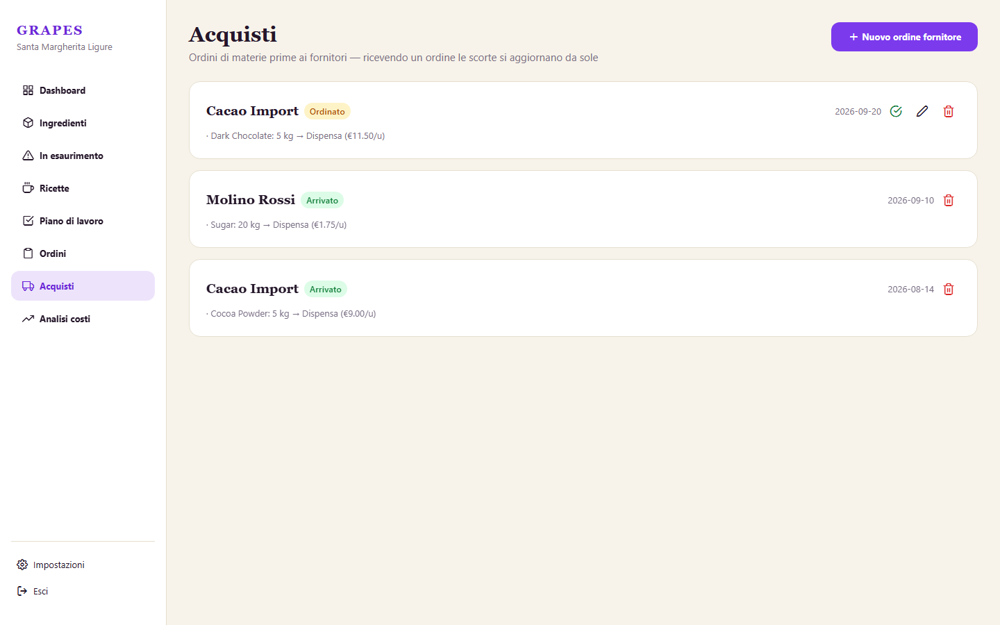

Il flusso è semplice:

1. Crei l'ordine fornitore (stato iniziale: **Ordinato**).
2. Quando la merce arriva fisicamente, clicchi l'icona di spunta per segnarlo come **Arrivato**.
3. Le scorte degli ingredienti coinvolti si aggiornano **da sole**, nei magazzini indicati — non serve reinserire le quantità a mano nella pagina Ingredienti.

> **Attenzione:** segnare un ordine come "Arrivato" aggiorna le scorte immediatamente e non è un'azione reversibile dall'app. Un ordine "Arrivato" non può più essere modificato: solo eliminato, se necessario.

---

## 7. Piano di lavoro

Qui organizzi cosa fare, un giorno alla volta. Un task può essere un semplice promemoria, oppure una vera e propria produzione che, una volta completata, aggiorna da sola le scorte.

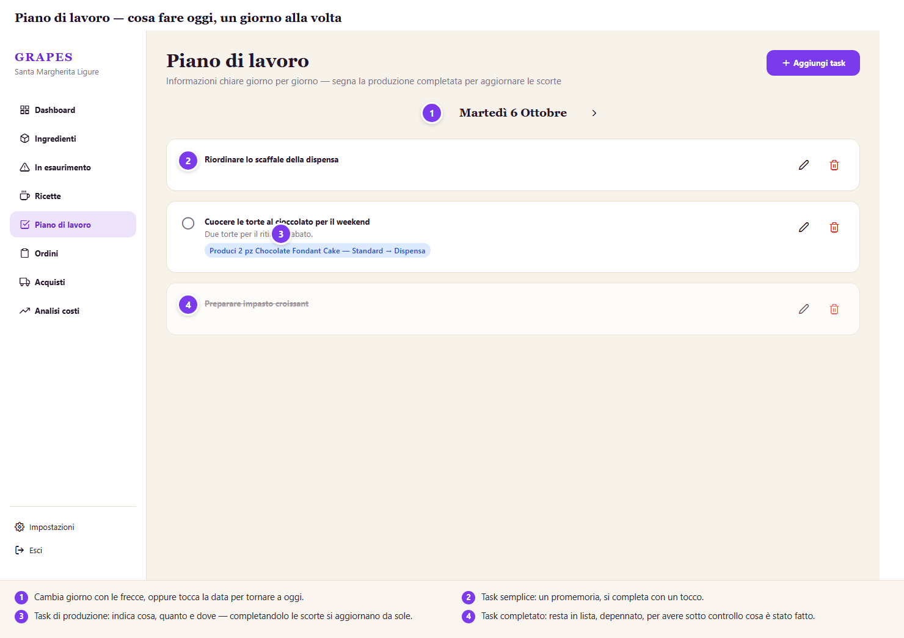

Tre tipi di task, tutti visibili nello screenshot sopra:

- **Task semplice** — solo un titolo (e note facoltative) da spuntare. Si completa con un tocco.
- **Task di produzione** — collegato a un Componente o a una Variante di ricetta: indichi quanto produrne e in quale magazzino mettere il risultato.
- **Task completato** — resta in lista, in fondo, con il testo depennato: così hai sempre sotto controllo cosa è stato fatto in giornata, invece di far sparire le attività una volta spuntate.

Quando completi un task di produzione, Grapes chiede solo **da quale magazzino prendere gli ingredienti** (tutto il resto — cosa, quanto, dove va il prodotto finito — è già deciso dal task):

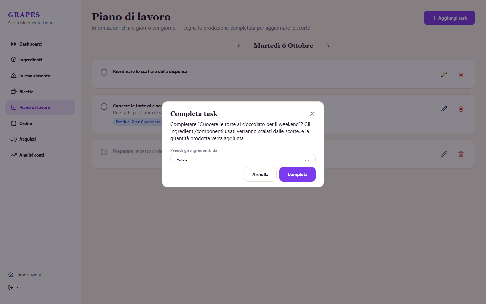

Confermando, in un'unica operazione: gli ingredienti (o i componenti) usati vengono scalati dal magazzino scelto, e la quantità prodotta viene aggiunta alle scorte del magazzino di destinazione.

> **E se non ho abbastanza ingredienti?** Grapes blocca l'operazione e mostra un messaggio d'errore, invece di far scendere le scorte sotto zero.

---

## 8. Analisi costi

Un grafico di come cambiano nel tempo i costi dei tuoi ingredienti — mese per mese nell'anno selezionato, e un confronto anno su anno.

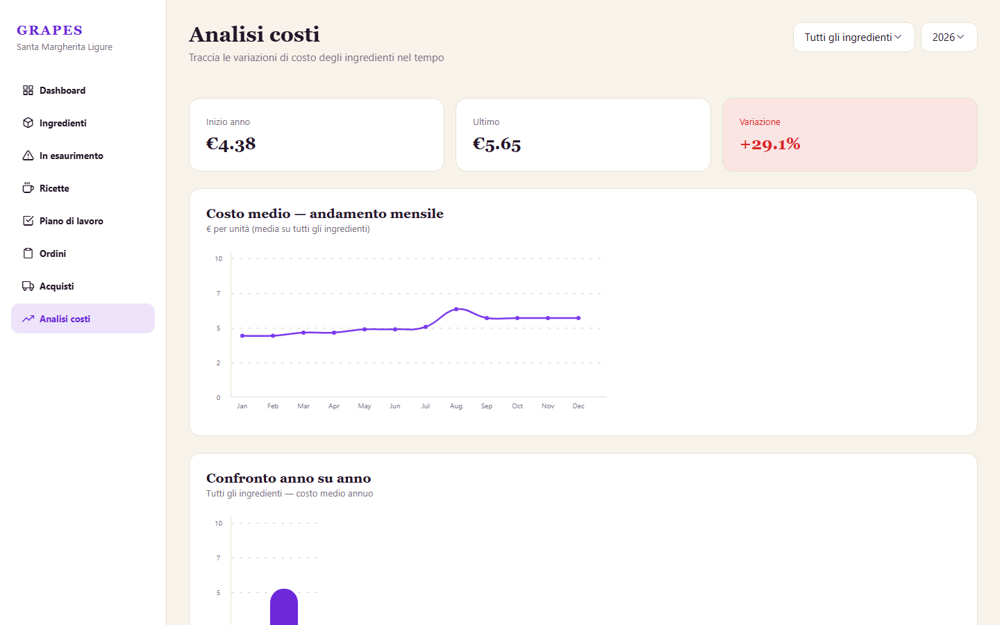

Ogni volta che modifichi il costo unitario di un ingrediente (nella pagina Ingredienti), Grapes registra automaticamente quella variazione con la data in cui è avvenuta — non devi fare nulla di più. Da questa pagina puoi poi:

- Guardare l'andamento di **un singolo ingrediente**, o la **media di tutti**.
- Confrontare il costo di **inizio anno** con quello **più recente**, e vedere subito la variazione percentuale.
- Capire, guardando il confronto anno su anno, se è il momento di rivedere i prezzi di vendita delle ricette che usano quell'ingrediente.

---

## 9. Impostazioni

Due preferenze, più il pulsante per uscire:

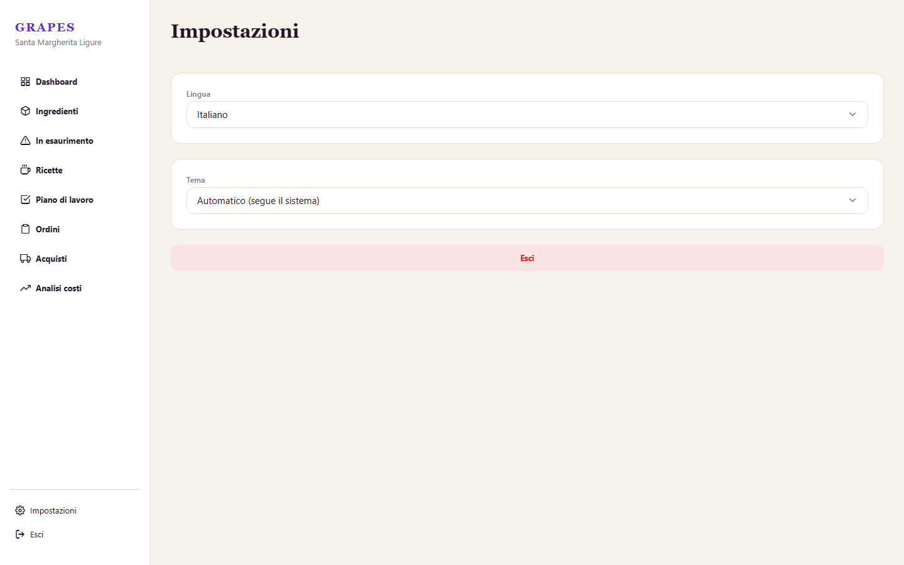

- **Lingua** — italiano o inglese. La preferenza è salvata sul tuo account (non solo sul dispositivo), quindi ti segue anche se accedi da un telefono o computer diverso.
- **Tema** — chiaro, scuro, o "automatico" per seguire l'impostazione del tuo dispositivo.

---

## Come si tiene insieme tutto

Le sezioni non sono isolate: quello che succede in una si riflette automaticamente nelle altre. Un solo "giro" di lavoro tipico attraversa quasi tutta l'app:

```
 1. Acquisti              2. Ingredienti           3. Piano di lavoro
    ordini ai fornitori  →   scorte aggiornate   →    produzione giornaliera
                                                              │
                                                              ▼
 5. Ordini              ←   4. Ricette
    torte da consegnare      costo sempre esatto
```

Ogni volta che qualcosa entra o esce dal laboratorio — un ordine fornitore ricevuto, una preparazione fatta, una torta consegnata — le scorte si aggiornano da sole. Il costo delle ricette non è mai una stima scritta a mano: è sempre calcolato sui prezzi reali degli ingredienti che hai inserito.

Questo significa, in pratica, che devi inserire ogni informazione **una volta sola, nel posto giusto**, e Grapes si occupa di farla "viaggiare" automaticamente dove serve: non devi aggiornare le scorte a mano dopo aver fatto un impasto, né ricalcolare il costo di una ricetta dopo un aumento di prezzo di un fornitore.

---

## Un'app, tutti i tuoi dispositivi

Grapes è pensata per essere usata tanto dal telefono in laboratorio quanto dal computer in ufficio, con lo stesso account e sempre gli stessi dati.

| | |
|---|---|
| 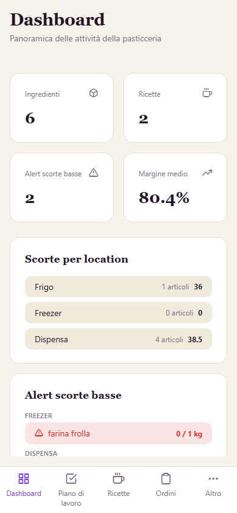 | 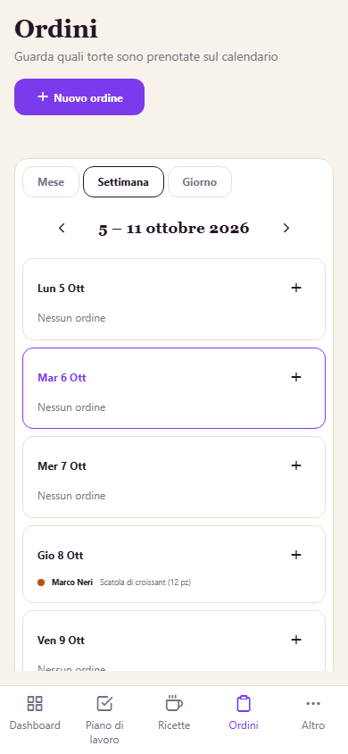 |

- **Sempre sincronizzata** — accedi con lo stesso account da telefono, tablet o computer: i dati sono sempre gli stessi e sempre aggiornati in tempo reale, ovunque tu li modifichi.
- **Layout adattivo** — su telefono trovi le sezioni più usate a portata di pollice in basso (Dashboard, Piano di lavoro, Ricette, Ordini), e le altre sotto "Altro"; su tablet e computer, tutte le sezioni sono sempre visibili nel menu laterale.

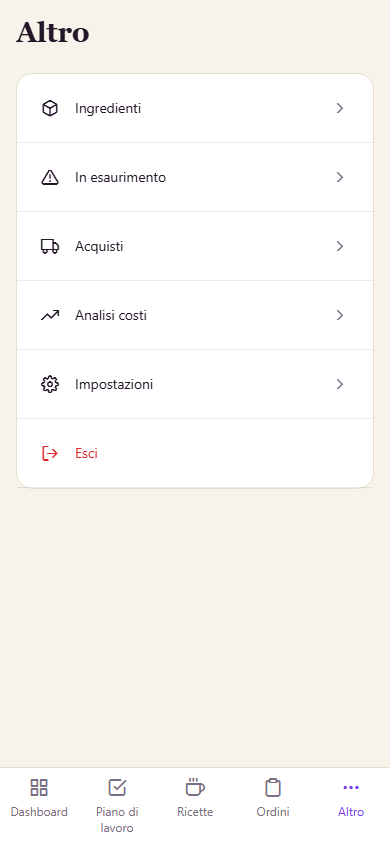

---

## Domande frequenti

**Posso registrare un ordine per una torta che non ho ancora creato come ricetta?**
Sì. Nel form dell'ordine il nome della torta è un campo libero: puoi scrivere qualsiasi cosa senza dover prima creare la ricetta corrispondente. Se vuoi tenere traccia di costo/margine, puoi comunque collegare una ricetta esistente.

**Cosa succede se sbaglio una quantità mentre registro un acquisto o completo un task?**
Puoi sempre tornare nella pagina Ingredienti e correggere la quantità a mano. Le operazioni automatiche (ricevere un ordine fornitore, completare un task di produzione) non sono annullabili con un semplice "indietro", quindi conviene ricontrollare i numeri prima di confermarle.

**Perché un ingrediente non compare tra gli "In esaurimento" anche se ne ho pochissimo?**
Controlla la soglia minima impostata per quell'ingrediente in quel magazzino, nella pagina Ingredienti: se è **0**, Grapes non genera nessun alert per quella combinazione ingrediente/magazzino, qualunque sia la quantità rimasta.

**Se cambio il costo di un ingrediente, le ricette che lo usano si aggiornano da sole?**
Sì, automaticamente: costo, prezzo e margine di ogni ricetta (e di ogni variante) sono sempre ricalcolati dai costi correnti degli ingredienti/componenti usati, ogni volta che apri la pagina Ricette.

**Posso usare Grapes anche senza connessione a internet?**
No: i dati vivono sul server (Supabase) e servono per sincronizzare tutti i tuoi dispositivi in tempo reale, quindi è necessaria una connessione internet per usare l'app.

**Come cambio la lingua dell'app?**
Dalle Impostazioni. La preferenza è legata al tuo account, non al dispositivo: se cambi lingua dal telefono, la ritroverai già cambiata anche aprendo l'app dal computer.

---

## Le sezioni in breve (tabella riassuntiva)

| Sezione | A cosa serve | Quando usarla |
|---|---|---|
| **Dashboard** | Colpo d'occhio su tutta l'attività | Appena apri l'app |
| **Ingredienti** | Scorte, costi, fornitori | Quando ricevi/consumi materie prime |
| **In esaurimento** | Tutto ciò che è sotto soglia | Prima di aprire il laboratorio o fare un ordine |
| **Ricette & Componenti** | Costo e margine di ogni ricetta | Quando crei o rivedi una ricetta/un prezzo |
| **Ordini** | Calendario delle consegne | Quando prendi o gestisci una prenotazione |
| **Acquisti** | Ordini ai fornitori | Quando ordini o ricevi materie prime |
| **Piano di lavoro** | Cosa fare oggi | Ogni mattina, per organizzare la giornata |
| **Analisi costi** | Andamento dei costi nel tempo | Quando valuti se rivedere i prezzi di vendita |
| **Impostazioni** | Lingua, tema, logout | Raramente, su preferenza personale |

---

*Grapes — Guida all'app · Santa Margherita Ligure*
